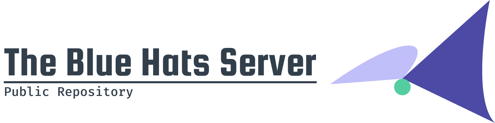

 

The new repository where The Blue Hats Server is maintained. ([Click here for the old repository](https://github.com/Im-Stevemmmmm/the-blue-hats-server-old))

## About

The Blue Hats Server is an open source community project that attempts to replicate The Hypixel Pit so that people may test enchants or play with friends on a local Minecraft server. This project was founded by Im-Stevemmmmm.

## Installation and Starting the Server

To install the server, download the latest release under the release section. Once you have the server zip downloaded, extract the zip.

### Starting the Server on Windows

Start up the server by opening the `start-server.bat` file.

### Starting the Server on MacOS / Unix

Open a terminal window in the server directory. Then, execute the command `./start-server`. You may need to set permissions to read and execute the script. If so, execute the command `chmod 755 start-server`.

### Connecting to the Server

Open up Minecraft in version 1.16.3 (1.8.8+ will be supported in the future). Once Minecraft is loaded, go to your server list and press add server or direct connect. For the server IP, type in localhost and press connect. For the best experience, it is recommended to log on with Minecraft 1.8.9.

To stop the server, execute the command in-game `/stop`.
